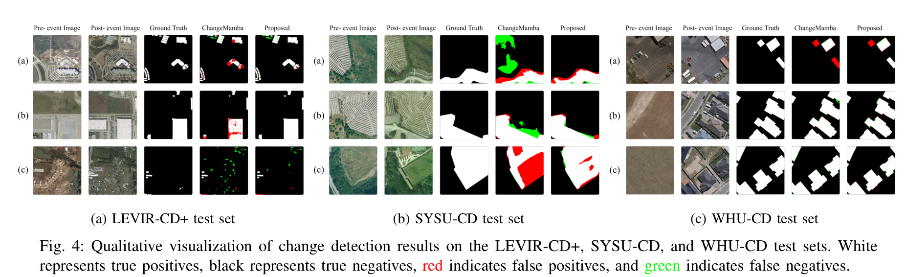
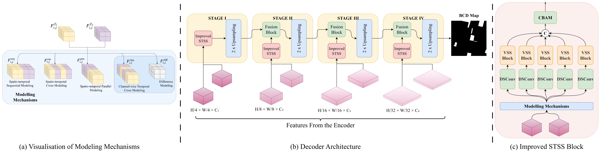

# Precision Spatio-Temporal Feature Fusion for Robust Remote Sensing Change Detection

  [](LICENSE)

Welcome to our cutting-edge implementation for remote sensing change detection! This project enhances the [ChangeMamba](https://github.com/ChenHongruixuan/ChangeMamba) architecture with **precision fusion blocks**, an **enhanced decoder pipeline**, and an **improved optimization strategy**, delivering unparalleled accuracy in detecting spatio-temporal changes.

---
## 🔥🔥 Updates 
 - Our paper is live at [IEEE Xplorer](https://ieeexplore.ieee.org/document/11450773)
---

## 🚀 Introduction

Monitoring changes in remote sensing imagery is vital for tracking environmental and urban dynamics. Our approach excels with:

- 🔍 **Precision Fusion Blocks**: Detect subtle temporal shifts using channel-wise cross modeling and explicit difference modules.
- 🧠 **Enhanced Decoder Pipeline**: Preserve fine details efficiently with lightweight convolutions and CBAM.
- ⚙️ **Optimized Learning**: Tackle class imbalance and boost IoU with a blend of Dice loss, cross-entropy, and Lovász objectives.

---

## 🛠️ Installation

Set up the project in a few simple steps:

1. **Clone the repository**:
   ```bash
   git clone https://github.com/Buddhi19/MambaCD.git
   cd MambaCD
   ```

2. **Create a Conda environment**:
   ```bash
   conda create -n mamba_cd
   conda activate mamba_cd
   ```

3. **Install dependencies**:
   - Install PyTorch following the [official instructions](https://docs.pytorch.org/get-started/locally/) for your system.
   - Install remaining dependencies:
     ```bash
     pip install -r requirements.txt
     ```

---

## 🎯 Quick Start

### 🏋️ Training
Kick off training with:
```bash
python train.py
```

### 🔍 Inference
Refer to `annotation/Ours.ipynb` for detailed inference steps.
---

## 📊 Results

Our model excels on datasets like LEVIR-CD+, SYSU-CD, and WHU-CD. See the qualitative results:




---

## 📥 Pretrained Models

Download our pretrained models below:

| Dataset   | IoU (%) | Download Link                          |
|-----------|---------|----------------------------------------|
| LEVIR-CD+ | 83.32    | [Link](https://drive.google.com/file/d/1uX0Yo8ov7EWlQr_EWxEM9UOwhdscY7M1/view?usp=drive_lin)                              |
| SYSU-CD   | 75.04    | [Link](https://drive.google.com/file/d/1e6irCYcRmmtC2GPxEdAFd9j0LXd4HWnw/view?usp=drive_link)                              |
| WHU-CD    | 89.95   | [Link](https://drive.google.com/file/d/1JJPZNxF9-3KhQyrQ5z6xuuHFVRD8hRlx/view?usp=drive_link)                              |


---

## 🧩 Key Features

Discover how our innovations elevate change detection:



*Caption*: Showcasing precision fusion blocks, enhanced decoder, and STSS block enhancements.

---

## If you find our work helpful please cite

```bibtex
@INPROCEEDINGS{11450773,
  author={Wijenayake, W.M.B.S.K. and Ratnayake, R.M.A.M.B. and Sumanasekara, D.M.U.P. and Wasalathilaka, N.S. and Piratheepan, M. and Godaliyadda, G.M.R.I. and Ekanayake, M.P.B. and Herath, H.M.V.R.},
  booktitle={2025 IEEE 19th International Conference on Industrial and Information Systems (ICIIS)}, 
  title={Precision Spatio-Temporal Feature Fusion for Robust Remote Sensing Change Detection}, 
  year={2026},
  volume={19},
  number={},
  pages={557-562},
  keywords={Accuracy;Computational modeling;Pipelines;Feature extraction;Transformers;Decoding;Remote sensing;Optimization;Monitoring;Context modeling;Remote Sensing;Binary Change Detection;State Space Models;Mamba},
  doi={10.1109/ICIIS69028.2026.11450773}}

```
You may also cite the experimental paper that confirms improvements caused by CBAM
```bibtex
@INPROCEEDINGS{11217111,
  author={Ratnayake, R.M.A.M.B. and Wijenayake, W.M.B.S.K. and Sumanasekara, D.M.U.P. and Godaliyadda, G.M.R.I. and Herath, H.M.V.R. and Ekanayake, M.P.B.},
  booktitle={2025 Moratuwa Engineering Research Conference (MERCon)}, 
  title={Enhanced SCanNet with CBAM and Dice Loss for Semantic Change Detection}, 
  year={2025},
  volume={},
  number={},
  pages={84-89},
  keywords={Training;Accuracy;Attention mechanisms;Sensitivity;Semantics;Refining;Feature extraction;Transformers;Power capacitors;Remote sensing},
  doi={10.1109/MERCon67903.2025.11217111}}

```

## 🙏 Acknowledgments

A heartfelt thank you to [ChenHongruixuan/ChangeMamba](https://github.com/ChenHongruixuan/ChangeMamba) for the foundational code that sparked this project!

---
